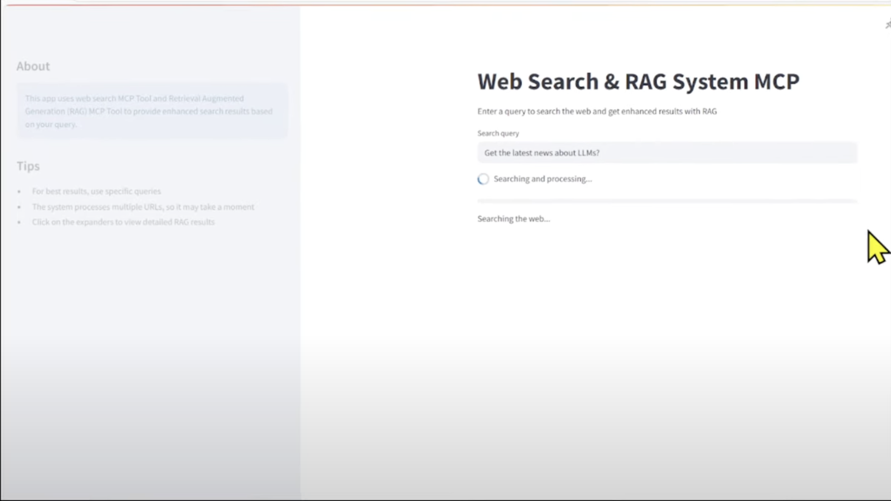
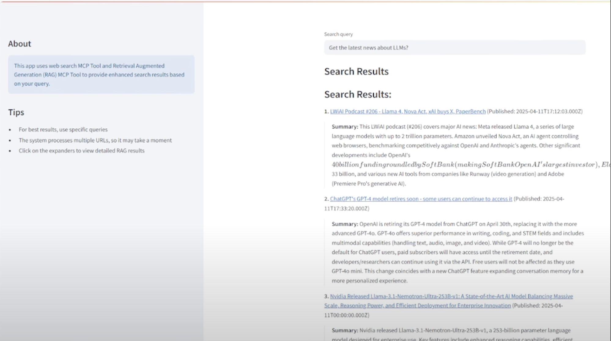

# 🧠 MultiContext-RAG (MCRAG)

**MultiContext-RAG (MCRAG)** is a multi-tool, retrieval-augmented generation (RAG) system that leverages **MCP (Model Context Protocol)** to integrate multiple web search and scraping agents. It uses LangChain to orchestrate OpenAI-powered agents across Tavily, Firecrawl, and Exa APIs, then enriches the responses using FAISS-powered RAG over live web content.

---
### 🔹 Main Streamlit UI



## ✨ Features

- 🔍 **Multi-Engine Web Search**
  - Tavily (general search)
  - Exa (developer/documentation search)
  - Firecrawl (real-time web info)
- 🌐 **Web Scraping & Content Parsing** via Firecrawl
- 🧠 **RAG (Retrieval-Augmented Generation)** using FAISS + LangChain
- 💬 **Streamlit UI** chat interface
- 🤖 **Agent Memory** using LangChain’s `ConversationBufferMemory`
- 🔧 **@mcp.tool** decorators for modular tool exposure
- 🛠️ **Modular structure** — easily extend or replace tools

---

## 📁 Project Structure

```
mcrag/
├── app.py                  # Streamlit UI
├── main.py                 # CLI entrypoint for testing RAG
├── config.py               # Environment & API key loader
├── mcp.py                  # Primary MCP agent class with tools
├── mcp_implementation.py   # Alt LangChain agent executor (if needed)
├── search_tools.py         # Tools for Tavily, Firecrawl, Exa (with @mcp.tool)
├── requirements.txt        # Python dependencies
├── .env                    # Local API key storage (not committed)
├── conversation_history.json # Saved chats (Streamlit)
```


---

## 🚀 Getting Started

### 1. Clone the Repository
```bash
git clone https://github.com/your-org/mcrag.git
cd mcrag
```

### 2. Install Python Dependencies
```bash
pip install -r requirements.txt
```

If using FAISS and LangChain Community tools:
```bash
pip install faiss-cpu langchain_community
```

---

## 🔐 Environment Setup

Create a `.env` file in the root:

```env
OPENAI_API_KEY=your-key
TAVILY_API_KEY=your-key
FIRECRAWL_API_KEY=your-key
EXA_API_KEY=your-key
MODEL_NAME=gpt-4-turbo-preview
TEMPERATURE=0.7
MAX_SEARCH_RESULTS=5
```

---

## 💬 Run Streamlit UI

```bash
streamlit run app.py
```

Open your browser at [http://localhost:8501](http://localhost:8501)

---

### 🔹 Response from Web Search + RAG




## 🧪 Run CLI Search + RAG

```bash
python main.py "what is model context protocol"
```

This will:
- Run a search via Exa
- Scrape contents from top links
- Perform RAG search over the scraped data
- Print both search + RAG results to terminal

---

## 🧠 How It Works

1. **User asks a question** in CLI or Streamlit
2. Agent chooses the best tool via `@mcp.tool`
3. Performs:
    - `tavily_search`
    - `exa_search`
    - `firecrawl_search`
4. Scrapes URLs via Firecrawl
5. Splits content with LangChain
6. Embeds using `OllamaEmbeddings` or OpenAI (configurable)
7. Stores & retrieves via FAISS
8. Renders result in UI or terminal

---

## 🧩 Key Components

### 🔹 MCP (Model Context Protocol)
All tools are exposed as modular MCP tools using:

```python
from fastmcp import mcp

@mcp.tool
async def exa_search(query: str): ...
```

### 🔹 LangChain Agent
Orchestrates tool usage with a prompt like:

```
"You are a helpful AI assistant with access to multiple search tools..."
```

### 🔹 Tools
Defined in `search_tools.py`:
- `tavily_search`
- `exa_search`
- `firecrawl_search`

Each returns JSON: `status`, `results`, and `error`.

---

## 📸 Streamlit Chat Interface

> `app.py` implements a memory-based chat with real-time feedback and session saving.

UI Features:
- Send query
- Visualize response
- Save to `conversation_history.json`
- Clear/reset session

---

## 🧪 MCP Agent Class

In `mcp.py`, a class called `MCP` is declared as:

```python
@mcp.tool
class MCP:
    ...
```

This class:
- Instantiates the LLM
- Initializes memory
- Loads tools
- Handles message orchestration
- Has `.process_query()` and `.save_conversation()` methods

---

## 📦 Python Requirements

Minimal `requirements.txt`:

```txt
langchain==0.1.0
langchain-openai==0.0.2
python-dotenv==1.0.0
streamlit==1.29.0
tiktoken==0.5.2
tavily-python==0.2.6
firecrawl==2.1.2
exa-py==1.12.1
faiss-cpu
langchain_community
```

---

## 💾 Saved Conversations

Stored in `conversation_history.json` whenever the user clicks "Save Conversation" in Streamlit.

Format:
```json
[
  { "role": "user", "content": "What is MCP?" },
  { "role": "assistant", "content": "MCP stands for Model Context Protocol..." }
]
```

---

## 🧠 Name Breakdown

- **MultiContext**: Inspired by the protocol’s emphasis on message-passing across tools
- **RAG**: Retrieval-augmented generation
- **MCRAG**: Powerful, plug-and-play architecture for agentic info retrieval

---

## 📌 To-Do / Ideas

- [ ] Add embeddings with Ollama or OpenAI switch
- [ ] Dockerize project
- [ ] Add automatic retry logic for failed tool calls
- [ ] Add PDF/Webpage ingestion from file

---

🧠 Happy building with MultiContext-RAG!
